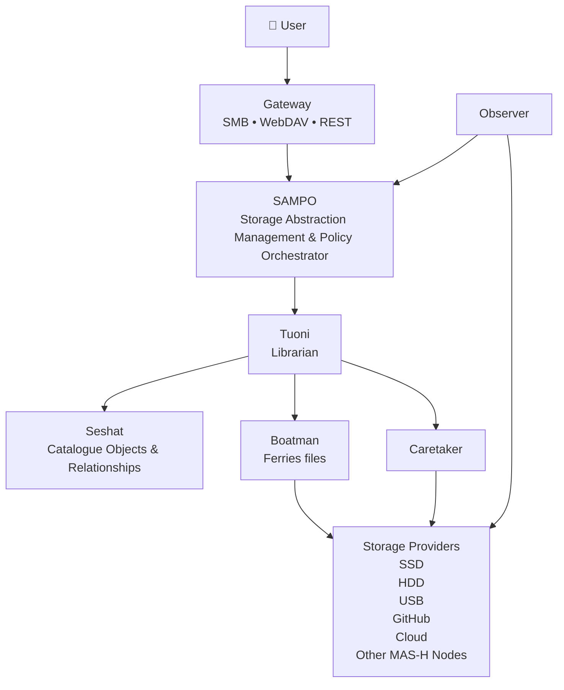

# MAS-H

## Memory Abstraction Storage Hypervisor

### Storage Hypervisor with a Digital Librarian control plane

MAS‑H abstracts heterogeneous storage providers and presents a unified library of objects, projects, and relationships to users. It preserves existing files, reduces human cognitive load, and orchestrates existing tools (Everything, Syncthing, Git, etc.) rather than replacing them.

**SAMPO – Storage Abstraction Management and Policy Orchestrator**

SAMPO is the reference storage engine for MAS‑H. It turns user intent into storage operations while hiding the complexity of heterogeneous storage providers. SAMPO itself does **not** store data; it coordinates a collection of specialised services (Staff), each with a single responsibility.

### SAMPO Staff Components

- **Tuoni** – reasoning engine that interprets user intent, consults the catalogue, applies storage policies, and produces storage decisions. It never performs storage I/O directly.
- **Seshat** – the catalogue that holds system knowledge: objects, relationships, versions, copies, health, provenance, policies, intent, etc.
- **Boatman** – executes transfer plans created by Tuoni (replication, migration, archiving, cache promotion/eviction).
- **Observer** – monitors the outside world (filesystem changes, storage‑provider availability, USB events, Git repos, cloud providers) and publishes raw events.
- **Caretaker** – performs background maintenance (hash verification, deduplication, replica repair, health checks, thumbnail generation, semantic indexing, archive & cache maintenance).
- **Gateway** – provides familiar interfaces (SMB, WebDAV, HTTP/REST) for users and applications, translating requests into SAMPO operations.

### High‑Level Architecture

## Design Principles

- Storage is an implementation detail.
- Search comes before folders.
- Users express intent, not implementation.
- MAS‑H never makes data less accessible.
- Existing open‑source tools are orchestrated, not replaced.
- Optimise human time before machine time.

## Documentation

- [VISION.md](VISION.md)
- [MANIFESTO.md](MANIFESTO.md)
- [ARCHITECTURE.md](ARCHITECTURE.md)
- [STAFF.md](STAFF.md)
- [OBJECT_MODEL.md](OBJECT_MODEL.md)
- [POLICIES.md](POLICIES.md)
- [GLOSSARY.md](GLOSSARY.md)
- [NON_GOALS.md](NON_GOALS.md)
- [EVENTS.md](EVENTS.md)
- [DECISIONS.md](DECISIONS.md)
- [PRIOR_ART.md](PRIOR_ART.md)

## Getting Started

Read the individual documents to understand the vision, architecture, terminology, and design decisions before any code is written.
