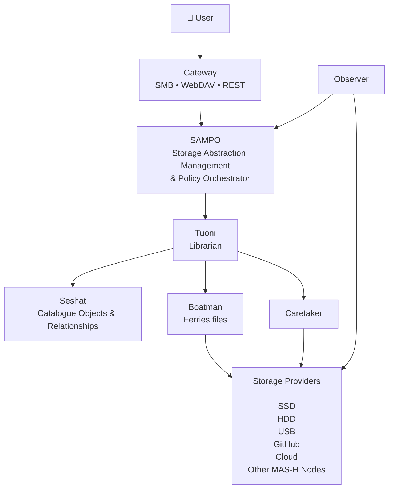

# MAS-H
## Memory Abstraction Storage Hypervisor

> A Storage Hypervisor with a Digital Librarian control plane.

MAS-H abstracts heterogeneous storage providers and presents a unified library of objects, projects, and relationships to users. It preserves existing files, reduces human cognitive load, and orchestrates existing tools (Everything, Syncthing, Git, etc.) rather than replacing them.

**Manifesto**

Modern operating systems ask users to remember where information is stored.

MAS-H argues that computers should remember where information is stored.

Humans should remember what they are looking for.

---

## Design Priorities

1. Preserve user data.
2. Reduce human cognitive load.
3. Prefer existing open‑source components.
4. Keep architecture simple.
5. Optimise machine performance only after optimising user experience.

---

## High-Level Architecture

## Design Principles

- Storage is an implementation detail.
- Search comes before folders.
- Users express intent, not implementation.
- MAS-H never makes data less accessible.
- Existing open-source tools are orchestrated, not replaced.
- Optimise human time before machine time.
## Documentation

- [VISION.md](VISION.md)
- [MANIFESTO.md](MANIFESTO.md)
- [ARCHITECTURE.md](ARCHITECTURE.md)
- [STAFF.md](STAFF.md)
- [OBJECT_MODEL.md](OBJECT_MODEL.md)
- [POLICIES.md](POLICIES.md)
- [GLOSSARY.md](GLOSSARY.md)
- [NON_GOALS.md](NON_GOALS.md)
- [EVENTS.md](EVENTS.md)
- [DECISIONS.md](DECISIONS.md)
- [PRIOR_ART.md](PRIOR_ART.md)

## Getting Started

Read the individual documents to understand the vision, architecture, terminology, and design decisions before any code is written.

